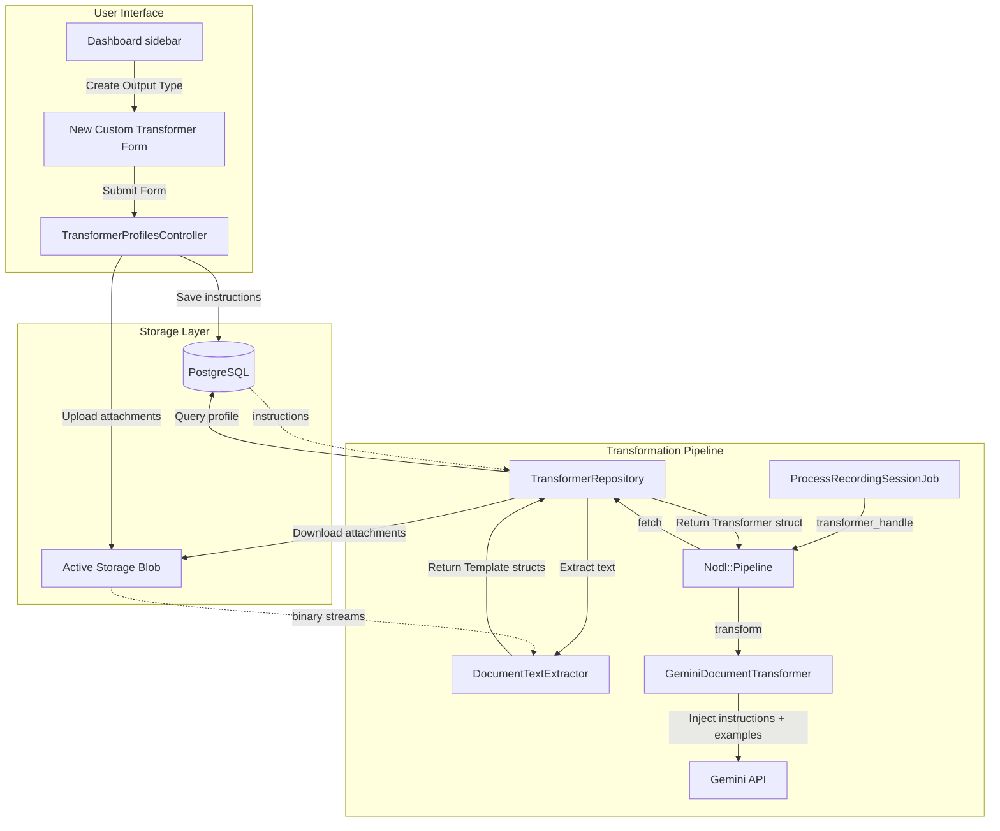

# Custom Transformers — Design Document

> Status: **Proposed** · Date: 2026-06-04 · Type: design-input
>
> This document describes the architecture and design of the custom transformer feature, allowing users to define their own instructions and upload reference files to guide document generation.

## 1. Summary

The Nodl platform turns raw voice transcripts into structured, well-typeset Markdown documents. Currently, the rules for this transformation (formatting guidelines, target tone, structure) are loaded from filesystem folders located under `transformers/` (e.g., `transformers/default`).

This design introduces **Custom Transformers** (also called Custom Output Types). It enables logged-in users to define their own instructions and upload up to 3 style examples directly from the web interface. These examples are processed, converted to plain text, and dynamically injected into the Gemini transformer prompt.

---

## 2. Goals

- **Custom Instructions:** Allow users to write specific prompts (instructions) telling the AI how to format, summarize, or structure their documents.
- **Reference Document Uploads:** Allow users to upload up to 3 reference files (`.docx`, `.odt`, `.pdf`, `.md`, `.txt`) to serve as style or format guides (few-shot context).
- **On-the-Fly Text Extraction:** Automatically extract text from these binary/text documents in pure Ruby during the document transformation job.
- **Seamless Prompt Injection:** Format and insert custom instructions and extracted reference content directly into the existing `GeminiDocumentTransformer` prompt architecture.
- **Workspace Scoped & Tenancy Safe:** Ensure custom output types are fully scoped to the workspace in which they are created.

---

## 3. Non-goals

- **Outputting binary files:** Generating `.docx` or `.pdf` as final output is out of scope; the output remains Markdown (rendered as beautiful HTML).
- **Persistent text storage:** Storing the extracted text of attachments inside database columns is not required; extracting text on-the-fly ensures simplicity and avoids desync.
- **Security Scans (Malware/Virus):** Running virus scanners on uploaded documents is out of scope.
- **Prompt Injection Defense:** Input sanitation to prevent prompt injection inside custom instructions is out of scope (as per the user story).

---

## 4. Locked Design Decisions

| # | Decision | Rationale |
|---|---|---|
| **D1** | **ActiveRecord Schema Expansion** | Add `instructions` to the `transformer_profiles` table; set `source_path` to `"db"` for custom profiles. This keeps the existing table and views fully compatible. |
| **D2** | **Active Storage for Referenzdateien** | Use Active Storage (`has_many_attached :example_files`) on `TransformerProfile`. It leverages Rails' native attachment capabilities and works out-of-the-box in development and production. |
| **D3** | **Pure Ruby Text Extraction** | Use pure Ruby gems (`pdf-reader` and `docx`) and native Ruby zip/XML parsing (`rubyzip` + `Nokogiri` for `.odt`). This avoids heavy binary dependencies (like JRE, Pandoc, or LibreOffice) inside the Docker container, keeping build times and image sizes lightweight. |
| **D4** | **Reusing the Template Prompt System** | Convert extracted example files into `Nodl::Transformation::Template` instances dynamically inside the repository. This maps reference files directly to the existing template rendering mechanism in `GeminiDocumentTransformer`. |

---

## 5. Architectural Overview

The diagram below shows how custom instructions and reference documents are saved, loaded, and eventually supplied to the Gemini LLM.



---

## 6. Detailed Technical Specifications

### 6.1 Database Schema & Model

The `transformer_profiles` table already exists and scopes output types to workspaces. We add `instructions` to it:

```ruby
# Migration
class AddInstructionsToTransformerProfiles < ActiveRecord::Migration[8.1]
  def change
    add_column :transformer_profiles, :instructions, :text
  end
end
```

The model `TransformerProfile` is updated with Active Storage attachments and validations:

```ruby
class TransformerProfile < ApplicationRecord
  belongs_to :workspace
  has_many_attached :example_files

  validates :instructions, presence: true, if: -> { source_path == "db" }
  validate :example_files_limit
  validate :example_files_content_types

  private

  def example_files_limit
    if example_files.size > 3
      errors.add(:example_files, "You can upload up to 3 example files.")
    end
  end

  def example_files_content_types
    allowed_types = %w[
      application/pdf
      application/vnd.openxmlformats-officedocument.wordprocessingml.document
      application/vnd.oasis.opendocument.text
      text/plain
      text/markdown
    ]
    example_files.each do |file|
      unless allowed_types.include?(file.content_type)
        errors.add(:example_files, "#{file.filename} has an unsupported format. Supported formats are: .docx, .odt, .pdf, .md, .txt")
      end
    end
  end
end
```

### 6.2 Pure Ruby Text Extraction (`DocumentTextExtractor`)

We introduce a service object `DocumentTextExtractor` responsible for extracting plaintext from supported formats:

- **`.txt`, `.md`:** Decoded as UTF-8 plaintext.
- **`.pdf`:** Handled via the `pdf-reader` gem, extracting text page-by-page.
- **`.docx`:** Handled via the `docx` gem, joining all document paragraphs.
- **`.odt`:** Since OpenOffice `.odt` files are zip files containing XML, we use `Zip::File` to read `content.xml` and pass it to `Nokogiri` to parse and extract text nodes.

```ruby
# app/services/document_text_extractor.rb
class DocumentTextExtractor
  def self.extract(attachment)
    return "" unless attachment.attached?

    attachment.open do |tempfile|
      case attachment.content_type
      when "text/plain", "text/markdown"
        File.read(tempfile.path, encoding: "UTF-8")
      when "application/pdf"
        reader = PDF::Reader.new(tempfile.path)
        reader.pages.map(&:text).join("\n\n")
      when "application/vnd.openxmlformats-officedocument.wordprocessingml.document"
        doc = Docx::Document.open(tempfile.path)
        doc.paragraphs.map(&:text).join("\n\n")
      when "application/vnd.oasis.opendocument.text"
        extract_odt(tempfile.path)
      else
        ""
      end
    end
  rescue StandardError => e
    Rails.logger.error("Text extraction failed for #{attachment.filename}: #{e.message}")
    ""
  end

  private

  def self.extract_odt(path)
    Zip::File.open(path) do |zip_file|
      entry = zip_file.find_entry("content.xml")
      return "" unless entry

      xml_content = entry.get_input_stream.read
      doc = Nokogiri::XML(xml_content)
      # Extract text from paragraph elements (text:p) and headings (text:h)
      doc.xpath("//text:p | //text:h").map(&:text).join("\n\n")
    end
  end
end
```

### 6.3 Adapting the Transformation Pipeline

We pass `workspace` down through the pipeline to enable DB resolution of handles:

#### `Nodl::Transformation::TransformerRepository`

Update `fetch` to load database profiles when `workspace` context is provided:

```ruby
# lib/nodl/transformation/transformer_repository.rb
def fetch(handle, workspace: nil)
  normalized_handle = normalize_handle(handle)

  if workspace
    profile = workspace.transformer_profiles.active.find_by(handle: normalized_handle)
    if profile && profile.source_path == "db"
      templates = profile.example_files.map do |file|
        extracted_content = DocumentTextExtractor.extract(file)
        Template.new(
          name: file.filename.to_s,
          path: nil,
          content: extracted_content
        )
      end

      return Transformer.new(
        handle: normalized_handle,
        path: nil,
        instructions: profile.instructions,
        templates: templates
      )
    end
  end

  # Fallback to filesystem loading...
end
```

#### `Nodl::Pipeline` and `RecordingSessionProcessor`

Ensure the active workspace is passed to `pipeline.run` and `transformer_repository.fetch`:

```ruby
# app/services/recording_session_processor.rb
result = pipeline.run(
  audio_path: normalized.path,
  transformer_handle: recording_session.transformer_handle,
  workspace: recording_session.workspace, # Added argument
  transcriber_model: ...,
  transformer_model: ...
)
```

And in `Nodl::Pipeline`:

```ruby
# lib/nodl/pipeline.rb
def run(audio_path:, transformer_handle:, transcriber_model:, transformer_model:, workspace: nil)
  ...
  transformer = transformer_repository.fetch(transformer_handle, workspace: workspace)
  ...
end
```

### 6.4 Web Interface and UX Flows

#### UI Integration inside the Dashboard

- **Dashboard sidebar (`app/views/dashboard/_activity.html.erb` or similar):**
  - Add a button "+ New custom output type".
  - For active, user-defined custom output types, show a small action menu (e.g. edit / delete) next to their names in the list.

#### Controller & Forms

We implement a basic CRUD interface for `TransformerProfile` under a new controller: `app/controllers/transformer_profiles_controller.rb`:

- **Form Fields:**
  - `name` (e.g., "Personal Journal Planner")
  - `handle` (auto-normalized to alphanumeric lowercase on submission, e.g., `journal-planner`)
  - `instructions` (textarea with guidance and placeholder)
  - `example_files` (file field accepting multiple uploads with limits)
- **Delete Reference Files:**
  - Standard Turbo-Stream action to delete single reference attachments from the edit view without deleting the whole transformer.

---

## 7. Test Plan

### 7.1 Unit Testing
- **`DocumentTextExtractorTest`:**
  - Create test fixtures with sample PDF, DOCX, ODT, MD, and TXT files containing specific keywords.
  - Verify `DocumentTextExtractor.extract` returns the correct textual content.
- **`TransformerProfileTest`:**
  - Validate model errors when trying to upload more than 3 example files.
  - Validate content type whitelist checks.
- **`TransformerRepositoryTest`:**
  - Mock database profiles and verify `fetch` with `workspace` context correctly returns `Transformer` structures with extracted examples.

### 7.2 Integration & System Testing
- **`CustomTransformersSystemTest`:**
  - Register/log in, navigate to "+ New Output Type".
  - Fill out the form, attach a reference PDF and DOCX, and click "Save".
  - Verify the new output type is listed under "Output types".
  - Create a new recording session, select the newly created output type, and process the audio.
  - Verify that the Gemini transformer received the instructions and examples in the constructed prompt.
