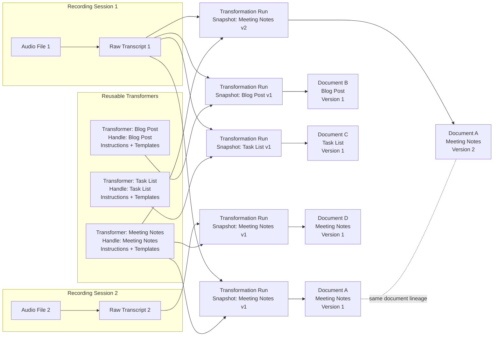

# NODL Pipeline: Recording, Transcript, Transformation, and Document Versioning

## 1. Recording Session

The user starts by recording audio. Each speaking session creates a **recording session**.

A recording session contains the original audio file and the raw transcript created from that audio file. The audio file and the raw transcript belong together and should not be treated as unrelated objects.

The **raw transcript** is the unchanged source material for all later processing steps. It should remain preserved and should not be overwritten by generated or edited documents.

### Core rules

- A recording session produces an audio file.
- The audio file is transcribed into a raw transcript.
- The audio file and raw transcript belong to the same recording session.
- The raw transcript remains the stable source for all transformations.

## 2. Transformer

A **transformer** is a reusable configuration that turns a raw transcript into a clean, structured document.

Each transformer has a **stable handle** — a name or identifier chosen by the user. Examples:

- Meeting Notes
- Blog Post
- Client Summary
- Task List
- Clinical Note
- Sales Call Summary

A transformer consists of:

- default instructions
- optional user-specific instructions
- optional one or more templates

The **default instructions** define the basic behavior. They tell the LLM to take the raw transcript from the user's audio recording and turn it into a clean, readable, well-structured text. This includes improving punctuation, formatting, paragraph structure, bullet points, grammar, and overall readability.

If the user provides custom instructions, those instructions are applied **in addition to** the default instructions.

If templates are provided, they serve as examples for the desired style, structure, format, and output type. Templates may be plain text, PDFs, Word documents, or other example documents.

The transformer is stored and managed separately from recordings, transcripts, transformations, and documents. A user can create and manage multiple transformers.

## 3. Transformation

A **transformation** is the concrete process of applying a transformer to a raw transcript.

During a transformation, the system combines:

- the raw transcript
- the selected transformer handle
- the transformer's current instructions
- the transformer's current templates
- the default transformation logic

The LLM then generates a cleaned document output.

A raw transcript can be transformed multiple times. The same transformer can be reused across many transcripts. Different transformers can also be applied to the same transcript to create different types of output.

### Examples

- The same transcript can become meeting notes.
- The same transcript can become a blog post.
- The same transcript can become a task list.
- Another transcript can be processed with the same Meeting Notes transformer.

## 4. Document

The result of a successful transformation is a **document**.

A document is the cleaned, usable output created from a raw transcript through a transformer. The user can read it, edit it, export it, download it, or use it elsewhere.

A document is not just free-floating generated text. It remains connected to its origin and to the transformation logic that created it.

Each document can be traced back to:

- the recording session
- the original audio file
- the raw transcript
- the transformer handle
- the transformer instructions used at the time
- the templates used at the time
- the transformation run that created the document or document version

## 5. Snapshotting

When a transformation runs, the transformer configuration is **snapshotted**.

This means the system stores the exact state of the transformer at the time of execution, including:

- the transformer handle
- the default instructions
- the user-specific instructions
- the templates used
- relevant template file references or extracted template content
- the raw transcript used
- the audio file connected to that transcript

This is important because transformers can change over time.

A user may later edit the instructions of a transformer, replace templates, remove templates, or add new ones. These later changes must **not** affect old documents or old document versions.

Every generated document version should remain historically accurate, traceable, and reproducible based on the snapshot that was used when it was created.

## 6. Document Identity and Versioning

A document is identified by the combination of:

> **Transcript + Transformer Handle**

This means that the transformer handle determines the logical document type for a given transcript.

- When a transcript is transformed with a specific transformer handle for the **first time**, a new document is created.
- When the same transcript is transformed again with the **same** transformer handle, the system does not create an unrelated new document. Instead, it creates a **new version** of the existing document.

This remains true even if the transformer has changed since the previous run.

### Example workflow

The user may have a transformer called **Meeting Notes**. The user first runs Transcript 1 through Meeting Notes, creating **Document A, Version 1**.

Later, the user changes the instructions or templates of the Meeting Notes transformer. If the user then runs the same Transcript 1 through Meeting Notes again, the system creates **Document A, Version 2**.

The document remains the same logical document because the transcript and transformer handle are the same. The output becomes a new version because the transformation was run again, potentially with a changed transformer snapshot.

If, however, the same transcript is transformed with a **different** transformer handle, a new document is created.

### Versioning matrix

| Input | Result |
| --- | --- |
| Transcript 1 + Meeting Notes | Document A, Version 1 |
| Transcript 1 + updated Meeting Notes | Document A, Version 2 |
| Transcript 1 + Blog Post | Document B, Version 1 |
| Transcript 1 + Task List | Document C, Version 1 |
| Transcript 2 + Meeting Notes | Document D, Version 1 |

### Rules in short

- Same transcript + same transformer handle → new version of the **same** document
- Same transcript + different transformer handle → **new** document
- Different transcript + same transformer handle → **new** document
- Each document version stores a full snapshot of the transformer configuration used at that time

## 7. Core Data Model

The pipeline separates the following concepts:

### Recording Session

The original user session in which audio was recorded.

**Contains:**

- audio file
- raw transcript

### Raw Transcript

The unmodified transcription of the audio file.

**Belongs to:**

- one recording session
- one audio file

**Can be used by:**

- many transformations
- many transformers

### Transformer

A reusable configuration for generating a specific kind of document.

**Contains:**

- stable handle
- default instructions
- optional user-specific instructions
- optional templates

**Can be used for:**

- many transcripts
- many transformations
- many document versions

### Transformation

A concrete execution of a transformer against a raw transcript.

**Uses:**

- one raw transcript
- one transformer handle
- one snapshot of the transformer configuration

**Produces:**

- one document version

### Document

The logical generated document for a specific transcript and transformer handle.

**Identified by:**

- transcript
- transformer handle

**Contains:**

- one or more document versions

### Document Version

A specific generated output from a transformation run.

**Belongs to:**

- one document

**Stores:**

- generated content
- transformation timestamp
- transformer snapshot
- instructions snapshot
- templates snapshot
- link to raw transcript
- link to original audio

## 8. Mermaid Diagram

## 9. Summary

NODL's pipeline is based on a clear separation between source material, reusable transformation logic, execution runs, and generated documents.

- The audio file and raw transcript belong to a **recording session** and remain the stable source material.
- **Transformers** are reusable configurations with stable handles. They define how a transcript should be turned into a specific type of document.
- A **transformation** is a concrete run of a transformer against a transcript. Each run snapshots the transformer's instructions and templates.
- **Documents** are grouped by transcript and transformer handle. Re-running the same transcript with the same transformer handle creates a new version of the same document. Running the same transcript with a different transformer handle creates a different document.
